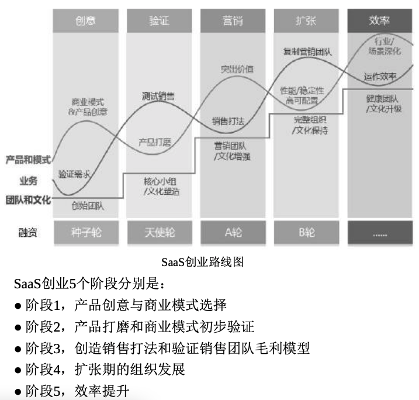

## 序章
### 第1节 产品的市场定位与商业模式
- 1.目标市场
  - SaaS产品最适合 **“橄榄型”** (营收占比维度)的目标市场。
    - 头部企业：他们的市场占有率也没有达到垄断地位，只有10%~30%，甚至更低。（更愿意选择定制化服务）
    - 中间部分：就如橄榄球的中部，有大量“中小企 业”(50~500人的企业)，并且占据着大部分市场份额。（愿意接受标准产品，不愿承担高额定制费用）
    - 市场尾部：“小微企业”(50人以下)，但市场份额并不高。（这是一个付费能力和意愿偏低、服务困难、续费率低的低质量目标市场）
  - 橄榄形市场的行业：餐饮、教育、健身房
  - 哑铃形市场的行业：医疗、金融、石化、供电、电信
- 2.波特五力模型：用于企业在准备进入市场、退出市场或行业政策突变时执行

  - 理解：波特五力模型的要素
    - 供应商谈判能力：供应商的谈判能力越强，企业的利润就越低。
    - 买家谈判能力：买家的谈判能力越强，企业的利润就越低。
    - 新进入者威胁：新进入者的威胁越大，企业的利润就越低。
    - 替代品威胁：替代品的威胁越大，企业的利润就越低。
    - 竞争对手：竞争对手越多，企业的利润就越低。
  - 举例：当你决定进入一个行业SaaS市场(例如SaaS工具市场，如CRM)：
    - 现有竞争者。通用SaaS领域比较成熟的CRM、HR、OA等。每个细分行业有1~3个头部SaaS公司和众多中小创业企业。在很多垂直行业的SaaS市场，还没有出现头部企业，但竞争者数量不少。相对来说，新出现的“行业+商业SaaS”产品的竞争对手是比较少的。
    - 新进入者的威胁。SaaS创业门槛很低，有三五个工程师就能组织创业。当然，从具体细分领域的情况看又各不相同。后文会专题分析SaaS公司的护城河。
    - 替代品的威胁。传统软件厂商的威胁不大，他们也逐渐往SaaS迁移，但目标客户企业内部存在新老产品交替的难题，有一个递进过程。
    - 买家议价能力。SaaS企业当然希望自己的目标市场呈“橄榄型”， 中型买家数量多、需求一致，这样面对买家的议价能力才会更高。如果只有目标行业的几个头部客户，而自己竞争者不少， 其议价能力自然很弱。
    - 供应商议价能力。SaaS企业的主要成本不是设备费用而是人员成本。和互联网巨头“抢人”，除了薪酬，也要多发挥创业公司自身的优势:更多自主决策的机会、更深的股权绑定、更有朝气的文化氛围......
  - 再介绍一个竞争对手分析工具：
 
| **维度/竞争对手** | **本公司** | **竞品1** | **竞品2** | **竞品3** |
|:----:|:----:|:----:|:----:|:----:|
| 现行目标    |  |  |  |   |
| 未来目标    |      |      |      |   |
| 现行战略    |      |      |      |   |
| 对手的能力  - Strength  - Weakness  - Opportunity  - Treaten  |      |      |      |   |
| 战略假设   |      |      |      |   |
| 行动方案   |      |      |      |   |
| 总结  - 学习点  - 空白点  - 应避开竞争点      |      |      |      |   |

- 3.产品创新的重要性 
- 4.SaaS公司的商业模式
  - 传统软件的买断模式
  - SaaS收年费
  - 消耗模式
  - 分销售额
  - 产业互联网:真正能够参与挖金矿，而不只是卖铁锹，企业才能获得更大的成功。
- 5.关于商业模式的分歧
### 第2节 SaaS的数据价值 
- 1.客户对云计算的接受程度逐年提高 
- 2.SaaS产品利用数据增值的路径设想
### 第3节 SaaS的本质是续费 
- 1.服务模式的影响 
- 2.销售模式的影响 
- 3.公司价值的影响
- 4.总结
### 第4节 路线图:SaaS创业的5个阶段和4条主线

- 4条主线分别:
  - 产品和模式
  - 业务
  - 团队和文化
  - 融资