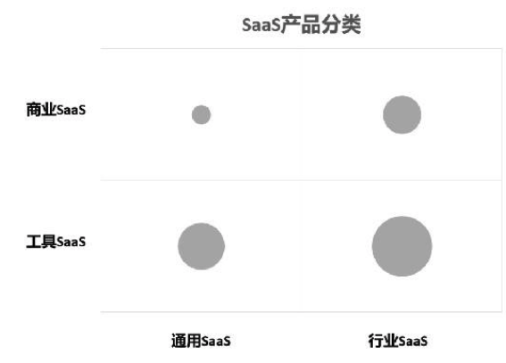
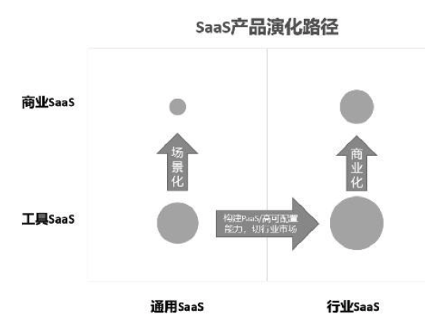
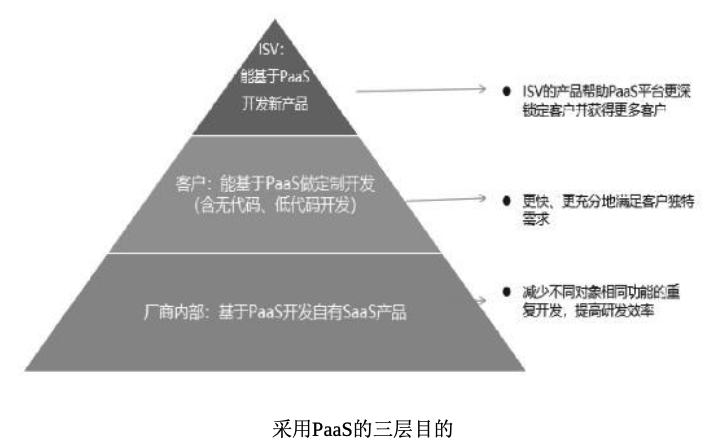
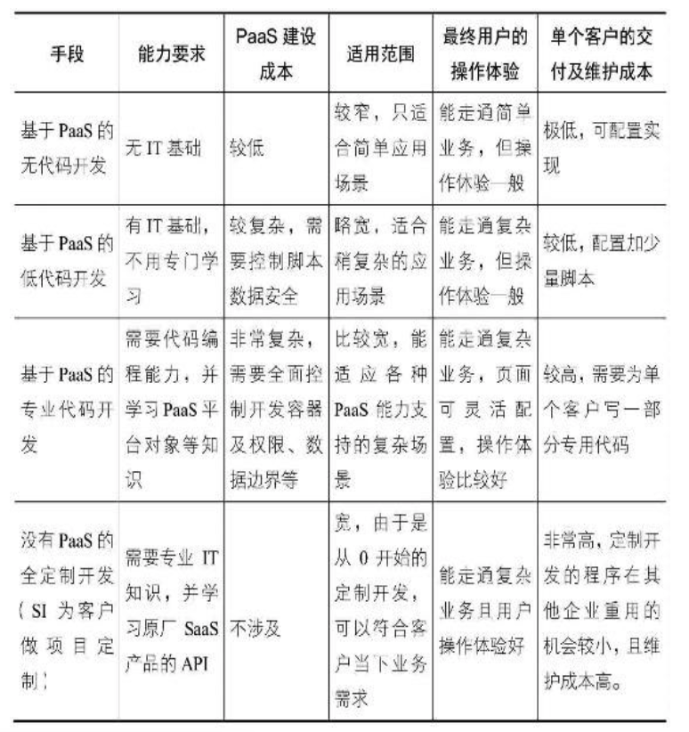

## 阶段1 产品创意与商业模式选择
### 第1节 SaaS产品分类及其发展方向 
- 1.通用SaaS vs行业SaaS (通用类赛道已被占满，新入场公司宜进入行业专属类)
- 2.工具SaaS vs商业SaaS (工具SaaS通过提高效率帮助客户省钱，而商业SaaS帮客户多挣钱)

- 3.关于“商业SaaS”的争议 
- 4.各类型SaaS产品间的转化路径

- 5.通用SaaS的PaaS路径 
- 6.行业SaaS从“工具”向“商业”转变 
- 7.通用SaaS增加“场景”价值
### 第2节 SaaS创业是否要做PaaS 
- 1.工具SaaS做PaaS的目的 
- 2.采用PaaS的三层目的

- 3.小结
### 第3节 商业SaaS的特征 
- 1.商业SaaS还是SaaS公司吗 
- 2.再谈谈数据 
- 3.并非“商业SaaS”的模式 
- 4.商业SaaS和传统B2B的区别 
- 5.小结:SaaS是路径，而非目的
### 第4节 工具SaaS公司转型商业SaaS的能力模型及发展路径 
- 1.商业SaaS的创始人
- 2.商业SaaS的组织
- 3.商业SaaS的内外部资源 
- 4.行业内工具型SaaS向商业SaaS转型的路径
- 5.小结
### 第5节 传统公司和传统软件公司转型SaaS
- 1.创新者的窘境 
- 2.传统软件转型SaaS的挑战更大 
- 3.应对策略
- 4.小结
### 第6节 SaaS公司的护城河在哪里
- 1.哪些不是护城河 
- 2.真正的护城河 
- 3.小结